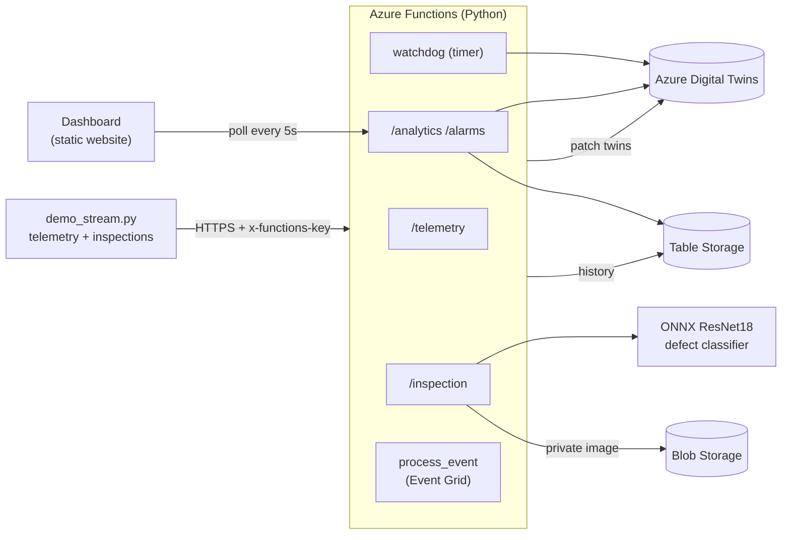
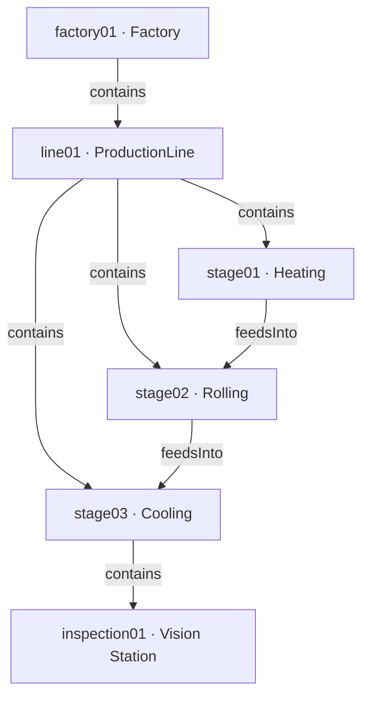

<div align="center">

# 🏭 FerroTwin

### AI-Powered Digital Twin for Real-Time Steel Surface Inspection

**Azure Digital Twins · Azure Functions · ONNX Computer Vision · Live Operations Dashboard**

FerroTwin turns a steel production line into a live, queryable **digital twin**. Process telemetry and deep-learning **surface-defect inspections** stream into an Azure Digital Twins graph, an alarm engine and analytics layer sit on top, and a real-time web dashboard visualizes the whole plant — deployable to Azure with a single script.


</div>

---

## 📖 Overview

FerroTwin is an end-to-end **Industrial IoT + MLOps** reference project. It models a multi-stage steel line (heating → rolling → cooling → inspection) as a digital twin, classifies steel-surface defects from images with a **ResNet18 ONNX** model, persists full history, raises rule-based **alarms**, and serves everything through a REST API and a polished real-time dashboard.

It is designed to be **reproducible and cloud-native**: infrastructure is reused or created via CLI, the twin graph is built from code, and the dashboard is hosted as an Azure Storage static website.

> **Keywords:** digital twin, Azure Digital Twins, DTDL, computer vision, steel surface defect detection, NEU-CLS, ONNX Runtime, Azure Functions, Event Grid, MLOps, Industry 4.0, real-time dashboard.

## ✨ Features

- 🧠 **AI visual inspection** — ResNet18 (transfer learning on NEU-CLS) exported to ONNX; 6 defect classes; torch-free serving (`onnxruntime` + NumPy) for a small, fast deployment package.
- 🌡️ **Live telemetry ingestion** — temperature/status readings patch the twin graph in real time.
- 🕸️ **Digital twin graph** — Factory → Line → Stages → Inspection Station, modeled in DTDL and built from code.
- 🚨 **8-rule alarm engine** — high/low temperature, temperature spike, stage error, repeated defect, low confidence, plus a **timer watchdog** for stale telemetry and prolonged idle (with debounce).
- 📊 **Analytics & history** — KPIs and time-series persisted to Azure Table Storage; private inspection images in Azure Blob Storage.
- 🖥️ **Real-time dashboard** — dependency-light HTML + Chart.js: KPI cards, multi-stage temperature trend, defect distribution, defect timeline, twin explorer, alarm feed, and in-browser image inspection.
- 🔀 **Two ingestion modes** — synchronous (default) or asynchronous via **Azure Event Grid** (opt-in).
- 🚀 **One-command deploy** — `deploy.ps1` provisions and publishes everything, reusing an existing Digital Twins instance.

## 🧭 Table of Contents

- [Live Demo](#-live-demo)
- [Architecture](#-architecture)
- [Tech Stack](#-tech-stack)
- [Project Structure](#-project-structure)
- [Quick Start](#-quick-start)
- [API Reference](#-api-reference)
- [Alarm Rules](#-alarm-rules)
- [The Model](#-the-model)
- [Testing](#-testing)
- [Roadmap](#-roadmap)
- [Documentation](#-documentation)
- [License & Acknowledgements](#-license--acknowledgements)

## 🔗 Live Demo

- **Dashboard (Azure Storage static website):** `https://ferrotwinst001.z6.web.core.windows.net`
  Click **Connect API** and provide a running API base URL + Function key to stream live data.
- **No-setup preview:** open [`dashboard/preview.html`](dashboard/preview.html) locally — a self-contained build with realistic mock data, so you can explore the full UI without deploying anything.

> The hosted dashboard shows data only when connected to a running FerroTwin API (the Function App may be stopped between demos to conserve credit).

## 🏛️ Architecture



**Twin graph**



Full component, sequence, and data-flow diagrams: **[docs/architecture.md](docs/architecture.md)**.

## 🛠️ Tech Stack

| Layer | Technology |
|-------|-----------|
| Twin graph | Azure Digital Twins (DTDL v2/v3) |
| Compute / API | Azure Functions v4 (Python 3.11, Linux Consumption) |
| Vision model | PyTorch (training) → ONNX Runtime (serving), ResNet18 |
| History | Azure Table Storage |
| Images | Azure Blob Storage (private) |
| Messaging (optional) | Azure Event Grid custom topic |
| Dashboard | HTML + vanilla JS + Chart.js on Azure Storage static website |
| IaC / deploy | Azure CLI + PowerShell (`deploy.ps1`) |

## 📁 Project Structure

```
ADT/
├── function_app.py            # Azure Functions app: all HTTP routes, watchdog, Event Grid trigger
├── inference_service.py       # ONNX inference (NumPy preprocessing, torch-free)
├── telemetry_service.py       # Telemetry → twin + history + alarms
├── inspection_twin_service.py # Inspection → stage + station twins
├── alarm_service.py           # 8-rule alarm engine + watchdog
├── analytics_service.py       # KPI aggregation
├── history_service.py         # Azure Table Storage history
├── storage_service.py         # Private Blob Storage for images
├── event_service.py           # Event Grid publishing (optional mode)
├── azure_clients.py           # Shared credentials/config
├── dtdl/                      # DTDL models: Factory, ProductionLine, ProcessStage, InspectionStation
├── scripts/                   # upload_models, create_twins, demo_stream, senders
├── dashboard/                 # index.html · app.js · styles.css · preview.html
├── models/                    # best_model.onnx (+ external data)
├── ml/                        # training + ONNX export
├── sample_images/             # 7 labeled sample defects for quick tests
├── tests/                     # unit tests (service layer)
├── docs/                      # architecture.md · api.md
├── deploy.ps1                 # one-command full-cloud deployment
├── deploy-eventgrid.ps1       # optional: enable Event Grid mode
├── DEPLOY.md                  # deployment runbook + troubleshooting
└── requirements.txt           # serving dependencies (no torch)
```

## 🚀 Quick Start

### Prerequisites

- [Azure CLI](https://aka.ms/installazurecli) · `az login`
- [Azure Functions Core Tools v4](https://learn.microsoft.com/azure/azure-functions/functions-run-local) — `npm i -g azure-functions-core-tools@4`
- Python 3.11+ · Node 20+ (for the dashboard preview tooling, optional)
- An Azure subscription with **Azure Digital Twins Data Owner** on your ADT instance

### Option A — Deploy to Azure (one command)

```powershell
git clone <your-repo-url> ADT
cd ADT
pip install -r requirements.txt
.\deploy.ps1
```

`deploy.ps1` discovers the resource group/region of the existing `ferrotwin-adt` instance, uploads the DTDL models, builds the twin graph, creates a Linux Python Function App with a managed identity (granted ADT Data Owner), applies settings, hosts the dashboard, configures CORS, and publishes the code. It prints the **Dashboard URL + API base URL + Function key** at the end.

Then generate live data:

```powershell
$env:FERROTWIN_FUNCTION_URL="https://<your-func>.azurewebsites.net/api"
$env:FERROTWIN_FUNCTION_KEY="<function-key>"
python scripts/demo_stream.py
```

Full runbook and troubleshooting: **[DEPLOY.md](DEPLOY.md)**.
Enable the asynchronous Event Grid architecture afterwards with `.\deploy-eventgrid.ps1`.

### Option B — Run locally (Functions host + Azurite + cloud ADT)

```powershell
azurite --location .\.azurite                       # terminal 1: storage emulator
func start --cors http://localhost:8080             # terminal 2: functions (needs local.settings.json)
python -m http.server 8080 --directory dashboard    # terminal 3: dashboard
# open http://localhost:8080 → Connect API → http://localhost:7071/api + a function key
```

> Azure Digital Twins has no local emulator, so a cloud ADT instance is always required. Copy `local.settings.example.json` → `local.settings.json` and fill in your values.

### Option C — Preview the UI (zero setup)

Open [`dashboard/preview.html`](dashboard/preview.html) in any browser.

## 🔌 API Reference

Base URL: `https://<function-app>.azurewebsites.net/api` · Auth: `x-functions-key` header (except `/health`, `/ping`).

| Method | Route | Description |
|--------|-------|-------------|
| `GET` | `/health` · `/ping` | Liveness + ADT connectivity (anonymous) |
| `POST` | `/telemetry` | Update a stage twin, log a reading, evaluate alarms |
| `POST` | `/inspection` | Classify an image (ONNX), store it, update twins, log |
| `GET` | `/analytics` | KPIs: avg/max temp, inspection count, defect rate & frequency |
| `GET` | `/alarms` | Recent alarms |
| `GET` | `/history/telemetry` · `/history/inspections` | Time-series history |
| `GET` | `/twins` | Full twin graph |
| `GET` | `/inspection-image?blobUrl=` | Proxy a private inspection image |

Complete request/response schemas: **[docs/api.md](docs/api.md)**.

## 🚨 Alarm Rules

| Rule | Trigger | Severity | Source |
|------|---------|----------|--------|
| `high_temperature` | temp ≥ threshold (900) | critical | telemetry |
| `low_temperature` | temp ≤ floor (if configured) | warning | telemetry |
| `temperature_spike` | \|temp − recent mean\| ≥ delta (45) | warning | telemetry |
| `stage_error` | status ∈ {error, failed, faulted} | critical | telemetry |
| `repeated_defect` | same defect ≥ 3 in 30 min | warning | inspection |
| `low_confidence` | confidence < 0.60 | warning | inspection |
| `stale_telemetry` | no reading for > 120 s | warning | watchdog (timer) |
| `prolonged_idle` | status Idle > 15 min | warning | watchdog (timer) |

All thresholds are environment-configurable (see `local.settings.example.json`). Watchdog alarms are debounced to avoid repeat noise.

## 🧠 The Model

- **Dataset:** [NEU-CLS](http://faculty.neu.edu.cn/songkechen/zh_CN/zhym/263269/list/) — Northeastern University surface-defect database. 6 classes: `crazing`, `inclusion`, `patches`, `pitted_surface`, `rolled-in_scale`, `scratches`.
- **Architecture:** ResNet18 transfer learning (ImageNet init).
- **Serving:** exported to ONNX; inference runs on `onnxruntime` + NumPy (no torch), keeping the Functions package small and cold-starts short.
- **Accuracy:** high on this dataset — the 7 bundled `sample_images/` classify correctly at ≥ 99.8% confidence.

Training and export code live in [`ml/`](ml/).

## ✅ Testing

```bash
python -m unittest tests.test_services -v
```

Covers the telemetry, alarm (including temperature-spike and low-confidence rules), analytics, and inspection-twin services with fakes — no Azure resources required.

## 🗺️ Roadmap

- [ ] Richer analytics (stage utilization, production health index)
- [ ] SignalR/WebSocket push in place of polling
- [ ] Statistical drift-attribution recommender (z-score + defect-class lift)
- [ ] Application Insights dashboards + alerting
- [ ] Azure AD / managed-identity auth end-to-end
- [ ] Interactive twin-graph visualization

## 📚 Documentation

- **[docs/architecture.md](docs/architecture.md)** — components, twin graph, sequence & data-flow diagrams, alarm rules, storage, security.
- **[docs/api.md](docs/api.md)** — full REST API reference.
- **[DEPLOY.md](DEPLOY.md)** — deployment runbook + troubleshooting.

## 📄 License & Acknowledgements

Released under the **MIT License** — add a `LICENSE` file if one is not present.

- **NEU-CLS** surface-defect dataset — Northeastern University (academic use; please cite the original authors).
- Built with Azure Digital Twins, Azure Functions, ONNX Runtime, and Chart.js.

<div align="center">

**⭐ If FerroTwin helped you, consider starring the repo.**

</div>
