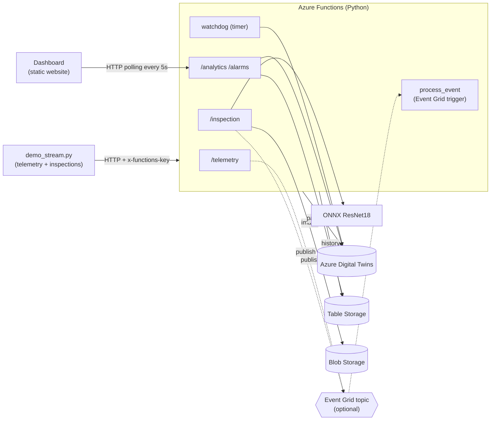
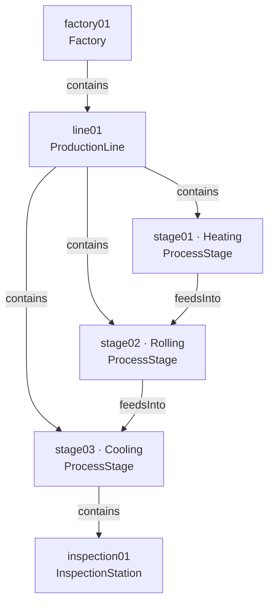
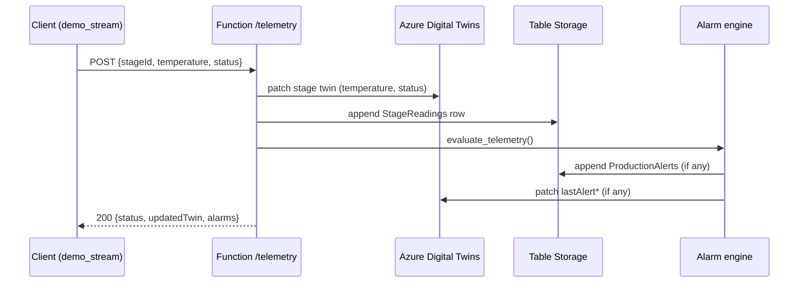
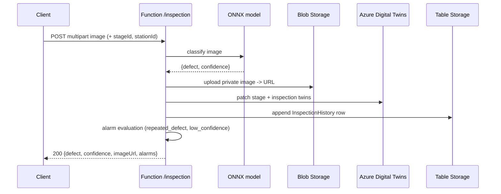
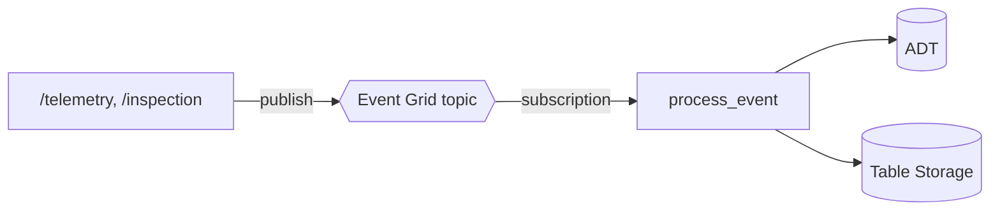

# FerroTwin — Architecture

FerroTwin is a computer-vision **digital twin** of a steel production line on
Azure. Telemetry and AI surface-defect inspections continuously update a live
twin graph; an alarm engine, analytics layer, and historical store sit on top;
a static dashboard visualizes the line in real time.

---

## 1. Components

| Component | Technology | Responsibility |
|-----------|------------|----------------|
| Twin graph | Azure Digital Twins (DTDL v2/v3) | Live model of factory → line → stages → inspection station |
| API / compute | Azure Functions (Python, Linux Consumption) | Telemetry + inspection ingestion, history/analytics/alarm APIs, watchdog timer, Event Grid consumer |
| Vision model | ONNX Runtime (ResNet18, NEU-CLS) | 6-class surface-defect classification |
| History | Azure Table Storage | Telemetry, inspection, and alarm records |
| Images | Azure Blob Storage (private) | Inspection images, referenced by URL on the twin |
| Dashboard | Static HTML/JS + Chart.js on Storage static website | Real-time operations view |
| Messaging (optional) | Azure Event Grid custom topic | Asynchronous, decoupled ingestion |

---

## 2. Digital twin graph

**Models** (`dtdl/`): `Factory;2`, `ProductionLine;2`, `ProcessStage;3`,
`InspectionStation;3` — all on the DTDL **v2 context** (chosen for ADT Explorer
compatibility). `ProcessStage` holds `status`, `temperature`,
`lastDetectedDefect`, `lastDefectConfidence`, and `lastAlert{Level,Message,Time}`.
`InspectionStation` holds `cameraId`, `lastDefect`, `confidence`,
`lastInspectionTime`, `lastImageUrl`, `lastInspectionId`.

The graph is built idempotently by `scripts/upload_models.py` (models) and
`scripts/create_twins.py` (twins + relationships).

---

## 3. Telemetry flow

## 4. Inspection flow

---

## 5. Ingestion modes

**Direct (default, `EVENT_GRID_ENABLED=false`)** — the HTTP handler performs the
twin update, history write, and alarm evaluation inline and returns `200`.
Simple and fully synchronous.

**Event-driven (`EVENT_GRID_ENABLED=true`)** — the handler publishes an event to
a custom Event Grid topic and returns `202 Accepted`; the `process_event`
trigger consumes it and does the work asynchronously. Decoupled and scalable.
Because events originate from our own handlers (not from ADT twin-change routes),
`process_event` never re-triggers itself — there is no feedback loop. Enable with
`deploy-eventgrid.ps1`.

---

## 6. Alarm rules

| Rule | Trigger | Severity | Source |
|------|---------|----------|--------|
| `high_temperature` | temp ≥ `TEMPERATURE_ALERT_THRESHOLD` (900) | critical | telemetry |
| `low_temperature` | temp ≤ `TEMPERATURE_MIN_THRESHOLD` (if set) | warning | telemetry |
| `temperature_spike` | \|temp − recent mean\| ≥ `TEMPERATURE_SPIKE_DELTA` (45) | warning | telemetry |
| `stage_error` | status ∈ {error, failed, faulted} | critical | telemetry |
| `repeated_defect` | same defect ≥ `REPEATED_DEFECT_COUNT` (3) in window (30 min) | warning | inspection |
| `low_confidence` | confidence < `CONFIDENCE_ALERT_THRESHOLD` (0.60) | warning | inspection |
| `stale_telemetry` | no reading for > `STALE_TELEMETRY_SECONDS` (120) | warning | watchdog (timer) |
| `prolonged_idle` | status Idle > `IDLE_ALERT_MINUTES` (15) | warning | watchdog (timer) |

The **watchdog** runs on a 1-minute timer, discovers stages via
`IS_OF_MODEL(...ProcessStage;3)`, and debounces repeat alarms
(`ALARM_DEBOUNCE_SECONDS`, default 300) so a standing condition is not re-raised
every tick. The most recent alarm per stage is mirrored onto the twin
(`lastAlertLevel/Message/Time`) for real-time clients.

---

## 7. Storage layout

Table Storage (partitioned by `stageId`):

- `StageReadings` — `temperature`, `status`, `recordedAt`
- `InspectionHistory` — `stationId`, `defect`, `confidence`, `imageUrl`, `recordedAt` (RowKey = inspection id, so redeliveries upsert)
- `ProductionAlerts` — `alarmType`, `severity`, `message`, `details`, `recordedAt`

Blob Storage: private container `inspections`, path
`YYYY/MM/DD/HHMMSS-<uuid>-<name>.jpg`. Images are never public — the dashboard
reads them through the authenticated `/inspection-image` proxy.

---

## 8. Security model

- Ingestion and query endpoints require a **Function key** (`x-functions-key`);
  `/health` and `/ping` are anonymous.
- The Function App authenticates to ADT with a **system-assigned managed
  identity** holding **Azure Digital Twins Data Owner** (data-plane role — not
  granted by subscription Owner/Contributor).
- Table and Blob access use the Functions storage connection string.
- Inspection images are private; the dashboard proxies them with the caller's key.

See **[api.md](api.md)** for the full endpoint reference and
**[../DEPLOY.md](../DEPLOY.md)** for deployment.
